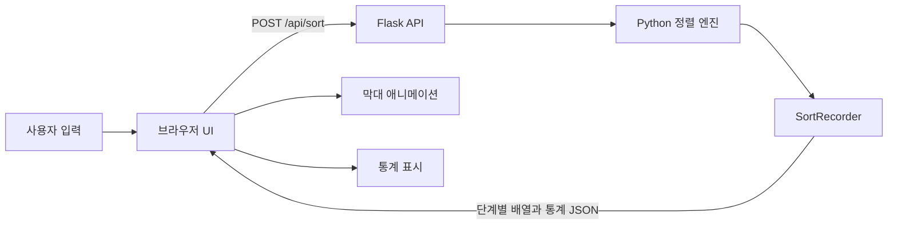

# Sort Lab — Sorting Algorithm Visualizer

Python과 Flask로 구현한 **정렬 알고리즘 시각화 웹 애플리케이션**입니다. 6가지 정렬 알고리즘의 실행 과정을 단계별 애니메이션으로 관찰하고, 비교 횟수·교환/쓰기 횟수·시간복잡도·실제 실행 시간을 함께 비교할 수 있습니다.

## 주요 기능

- Bubble, Selection, Insertion, Merge, Quick, Heap Sort 지원
- 비교 대상, 교환 위치, 정렬 완료 영역을 색상으로 구분
- 데이터 개수(5~60개)와 애니메이션 속도 조절
- 비교 횟수와 교환/배열 쓰기 횟수 실시간 표시
- 알고리즘별 최선·평균·최악 시간복잡도와 공간복잡도 비교
- 데이터 크기별 3회 평균 실행 시간을 Chart.js 그래프로 표시
- 데스크톱과 모바일을 지원하는 반응형 UI

## 기술 스택

| 영역 | 기술 | 사용 목적 |
|---|---|---|
| Backend | Python 3, Flask | 정렬 실행, 단계 기록, REST API 제공 |
| Frontend | HTML5, CSS3, JavaScript | 애니메이션과 사용자 인터랙션 |
| Chart | Chart.js | 데이터 개수별 실행 시간 시각화 |
| Template | Jinja2 | 알고리즘 메타데이터를 HTML에 렌더링 |

## 동작 구조



정렬 자체는 Python에서 수행합니다. `SortRecorder`가 알고리즘 실행 중 배열 상태와 활성 인덱스, 비교 횟수, 교환/쓰기 횟수를 기록하고, 브라우저는 전달받은 단계들을 순서대로 재생합니다.

## 알고리즘 비교

| 알고리즘 | 최선 | 평균 | 최악 | 공간 | 특징 |
|---|---:|---:|---:|---:|---|
| Bubble Sort | O(n) | O(n²) | O(n²) | O(1) | 인접한 두 원소를 반복 비교 |
| Selection Sort | O(n²) | O(n²) | O(n²) | O(1) | 최솟값을 찾아 앞쪽에 배치 |
| Insertion Sort | O(n) | O(n²) | O(n²) | O(1) | 정렬된 구간의 알맞은 위치에 삽입 |
| Merge Sort | O(n log n) | O(n log n) | O(n log n) | O(n) | 분할 후 정렬된 부분 배열을 병합 |
| Quick Sort | O(n log n) | O(n log n) | O(n²) | O(log n) | 피벗 기준으로 분할하여 재귀 정렬 |
| Heap Sort | O(n log n) | O(n log n) | O(n log n) | O(1) | 최대 힙의 루트를 뒤쪽부터 확정 |

## 실행 방법

```powershell
python -m venv .venv
.venv\Scripts\Activate.ps1
pip install -r requirements.txt
python app.py
```

브라우저에서 [http://127.0.0.1:5000](http://127.0.0.1:5000)에 접속합니다.

> 성능 그래프는 Chart.js CDN을 사용하므로 인터넷 연결이 필요합니다.

## API

### `POST /api/sort`

선택한 알고리즘을 실행하고 애니메이션에 필요한 전체 단계를 반환합니다.

```json
{
  "algorithm": "quick",
  "values": [42, 17, 8, 31]
}
```

### `POST /api/benchmark`

선택한 알고리즘을 10~400개의 무작위 데이터로 각각 3회 실행하고 평균 시간을 밀리초 단위로 반환합니다.

## 상세 기술 문서

알고리즘별 원리와 구현 방식, 주요 함수, API 시퀀스, 통계 집계 기준은 [기술 구현 가이드](docs/TECHNICAL_GUIDE.md)에서 확인할 수 있습니다.

## 프로젝트 구조

```text
SortingAlgorithmVisualizer/
├── app.py                    # Flask API, 정렬 알고리즘, 단계 기록기
├── requirements.txt         # Python 의존성
├── templates/
│   └── index.html            # 메인 화면 템플릿
├── static/
│   ├── app.js                # API 호출, 애니메이션, 차트 렌더링
│   └── style.css             # 반응형 UI 스타일
└── docs/
    └── TECHNICAL_GUIDE.md    # 알고리즘 및 구현 상세 문서
```
