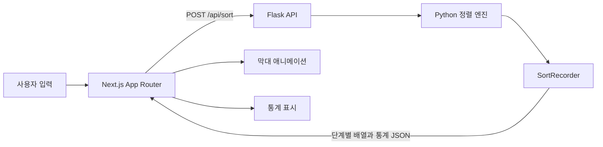
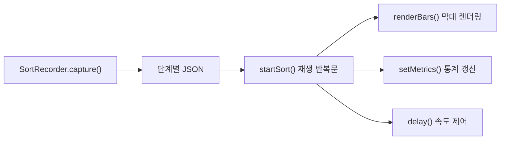

# Sort Lab — Sorting Algorithm Visualizer

Next.js와 Python Flask로 구현한 **정렬 알고리즘 활용·시각화 웹 애플리케이션**입니다. 6가지 정렬 알고리즘의 실행 과정뿐 아니라 알고리즘마다 잘 맞는 실제 활용 분야를 후보 3개씩 비교하고, 선정 사례를 인터랙티브하게 실행할 수 있습니다.

## 주요 기능

- Bubble, Selection, Insertion, Merge, Quick, Heap Sort 지원
- 비교 대상, 교환 위치, 정렬 완료 영역을 색상으로 구분
- 데이터 개수(5~50개)와 애니메이션 속도 조절
- 비교 횟수와 교환/배열 쓰기 횟수 실시간 표시
- 알고리즘별 최선·평균·최악 시간복잡도와 공간복잡도 비교
- 데이터 크기별 3회 평균 실행 시간을 Next.js 성능 표로 표시
- 데스크톱과 모바일을 지원하는 반응형 UI
- 알고리즘별 활용 후보 3개, 총 18개 사례 비교
- 선정 사례 6개를 실행하는 독립 Next.js 페이지

## 기술 스택

| 영역 | 기술 | 사용 목적 |
|---|---|---|
| Frontend | Next.js 16, React 19, TypeScript | App Router 기반 페이지와 인터랙션 |
| Backend | Python 3, Flask | 정렬 실행, 단계 기록, REST API 제공 |
| Styling | CSS Modules가 아닌 전역 디자인 시스템 | 반응형 레이아웃과 알고리즘별 색상 |

## 동작 구조



정렬 자체는 Python에서 수행합니다. `SortRecorder`가 알고리즘 실행 중 배열 상태와 활성 인덱스, 비교 횟수, 교환/쓰기 횟수를 기록하고, 브라우저는 전달받은 단계들을 순서대로 재생합니다.

## SORT LAB 정렬 애니메이션

`SORT LAB`은 정렬 엔진의 내부 상태를 막대 그래프로 재생하는 이 프로젝트의 시각화 UI입니다. Python이 계산과 단계 기록을 담당하고, JavaScript는 전달받은 프레임을 설정된 속도로 렌더링합니다. 이 분리 덕분에 알고리즘 코드를 수정하지 않고도 화면 디자인이나 재생 방식을 변경할 수 있습니다.

| 화면 표현 | 의미 |
|---|---|
| 검정 막대 | 아직 연산하지 않았거나 현재 대기 중인 원소 |
| 주황 막대 | 현재 비교·교환·이동 중인 원소 |
| 연두 막대 | 최종 정렬 위치가 확정된 원소 |

애니메이션 화면에서는 다음 기능을 제공합니다.

- 데이터 개수에 맞춰 무작위 배열 생성
- 알고리즘과 3단계 재생 속도 선택
- 정렬 시작, 일시정지, 계속하기
- 비교 횟수와 교환/쓰기 횟수 실시간 갱신
- 이전 실행이 새 실행 화면을 덮어쓰지 않도록 실행 토큰으로 안전하게 취소
- 데이터가 30개를 초과하면 막대 숫자를 숨겨 시인성 유지



## 정렬 모듈 사용법

정렬 엔진은 Flask와 분리된 `sorting` 패키지이므로 다른 Python 프로젝트에서도 바로 사용할 수 있습니다. 입력 데이터는 복사하여 처리하므로 원본은 변경되지 않습니다.

```python
from sorting import available_algorithms, sort

numbers = [42, 17, 8, 31]
result = sort(numbers, algorithm="merge")

print(result.values)       # [8, 17, 31, 42]
print(result.comparisons)  # 값 비교 횟수
print(result.swaps)        # 교환 또는 배열 쓰기 횟수
print(numbers)             # [42, 17, 8, 31] — 원본 유지
print(available_algorithms())
```

시각화 단계가 필요할 때만 `record_steps=True`를 지정합니다.

```python
result = sort([3, 1, 2], algorithm="quick", record_steps=True)
for step in result.steps:
    print(step["values"], step["message"])
```

## 알고리즘 비교

| 알고리즘 | 최선 | 평균 | 최악 | 공간 | 특징 |
|---|---:|---:|---:|---:|---|
| Bubble Sort | O(n) | O(n²) | O(n²) | O(1) | 인접한 두 원소를 반복 비교 |
| Selection Sort | O(n²) | O(n²) | O(n²) | O(1) | 최솟값을 찾아 앞쪽에 배치 |
| Insertion Sort | O(n) | O(n²) | O(n²) | O(1) | 정렬된 구간의 알맞은 위치에 삽입 |
| Merge Sort | O(n log n) | O(n log n) | O(n log n) | O(n) | 분할 후 정렬된 부분 배열을 병합 |
| Quick Sort | O(n log n) | O(n log n) | O(n²) | O(log n) | 피벗 기준으로 분할하여 재귀 정렬 |
| Heap Sort | O(n log n) | O(n log n) | O(n log n) | O(1) | 최대 힙의 루트를 뒤쪽부터 확정 |

## 활용 사례 선정

| 알고리즘 | 후보 1 | 후보 2 | 후보 3 | 선정 페이지 |
|---|---|---|---|---|
| Bubble | 소규모 실시간 순위표 | 센서값 정리 | 정렬 교육 | 소규모 실시간 순위표 |
| Selection | 쇼핑몰 최저가 | 창고 출고 피킹 | 플래시 메모리 | 쇼핑몰 최저가 |
| Insertion | 이벤트 타임라인 | 경기 점수표 | 소형 파일 정렬 | 이벤트 타임라인 |
| Merge | 배송 로그 병합 | 대용량 외부 정렬 | 연결 리스트 | 배송 로그 병합 |
| Quick | 상품 가격 카탈로그 | 인메모리 정렬 | 분할 분석 | 상품 가격 카탈로그 |
| Heap | 긴급 작업 스케줄러 | Top-K 추천 | 패킷 큐 | 긴급 작업 스케줄러 |

## 실행 방법

백엔드와 프런트엔드를 각각 실행합니다.

### 1. Flask API

```powershell
python -m venv .venv
.venv\Scripts\Activate.ps1
pip install -r requirements.txt
python app.py
```

### 2. Next.js 프런트엔드

```powershell
cd frontend
pnpm install
pnpm dev
```

브라우저에서 [http://localhost:3000](http://localhost:3000)에 접속합니다. Flask API는 `http://127.0.0.1:5000`에서 실행되며 Next.js rewrite가 `/backend/*` 요청을 프록시합니다.

## API

### `POST /api/sort`

선택한 알고리즘을 실행하고 애니메이션에 필요한 전체 단계를 반환합니다.

```json
{
  "algorithm": "quick",
  "values": [42, 17, 8, 31]
}
```

### `POST /api/benchmark`

선택한 알고리즘을 10~400개의 무작위 데이터로 각각 3회 실행하고 평균 시간을 밀리초 단위로 반환합니다.

## 상세 기술 문서

알고리즘별 원리와 구현 방식, 주요 함수, API 시퀀스, 통계 집계 기준은 [기술 구현 가이드](docs/TECHNICAL_GUIDE.md)에서 확인할 수 있습니다.

## 프로젝트 구조

```text
SortingAlgorithmVisualizer/
├── app.py                    # Flask 라우팅과 HTTP 입력 검증
├── frontend/                 # Next.js 16 App Router 프런트엔드
│   ├── src/app/              # 홈, 실험실, 알고리즘별 독립 페이지
│   │   └── use-cases/
│   │       ├── bubble/page.tsx
│   │       ├── selection/page.tsx
│   │       ├── insertion/page.tsx
│   │       ├── merge/page.tsx
│   │       ├── quick/page.tsx
│   │       └── heap/page.tsx
│   ├── src/components/       # 정렬·사례·벤치마크 인터랙션
│   ├── src/data/             # 18개 활용 후보와 선정 데이터
│   └── package.json
├── sorting/                  # Flask와 독립적인 정렬 패키지
│   ├── __init__.py           # 외부에 공개하는 패키지 API
│   ├── algorithms.py         # 6개 정렬 알고리즘 구현
│   ├── models.py             # 결과 및 시각화 단계 모델
│   └── registry.py           # 알고리즘 레지스트리와 sort() 함수
├── tests/
│   └── test_sorting.py       # 정렬 패키지 단위 테스트
├── requirements.txt         # Python 의존성
└── docs/
    └── TECHNICAL_GUIDE.md    # 알고리즘 및 구현 상세 문서
```
