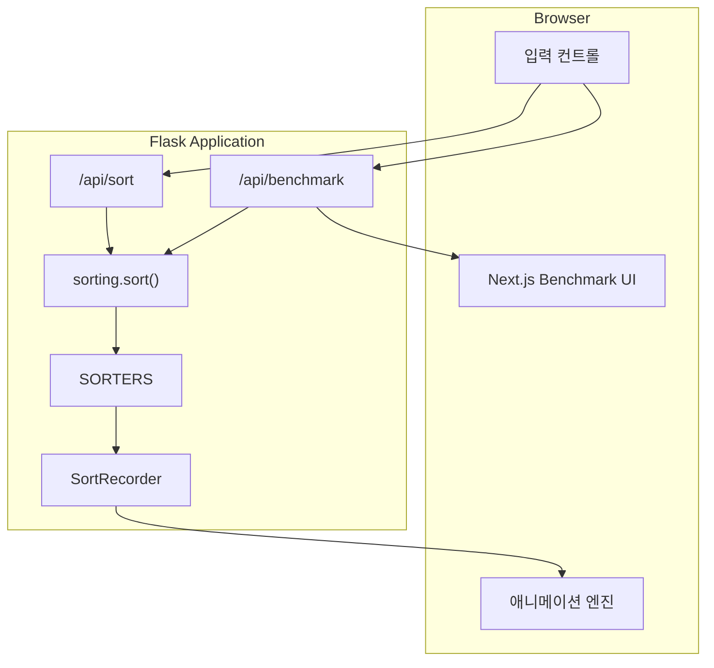
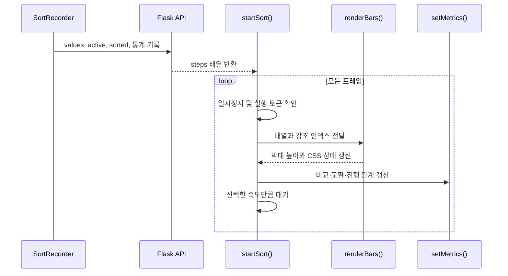
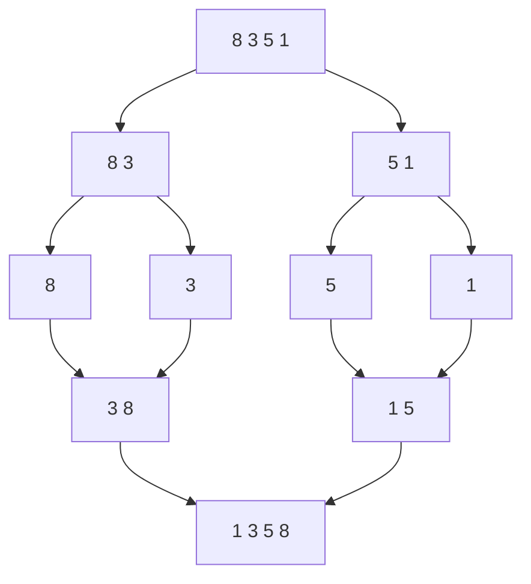
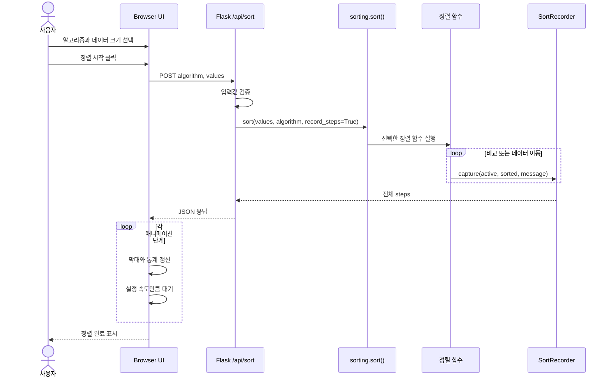
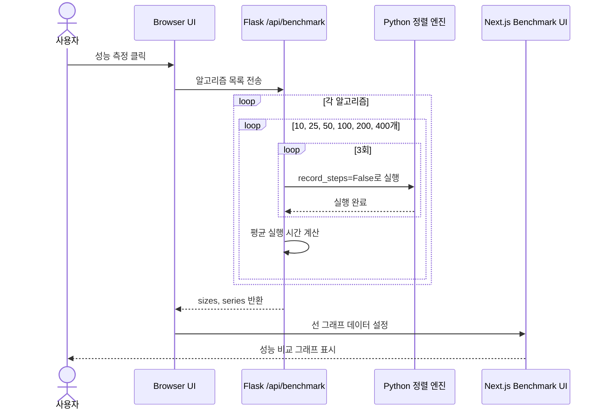

# Sort Lab 기술 구현 가이드

## 1. 설계 목표

이 프로젝트는 단순히 정렬 결과만 보여주지 않고, **알고리즘이 어떤 원소를 비교하고 어떻게 데이터를 이동시키는지**를 단계별로 설명하는 것을 목표로 합니다.

핵심 설계 원칙은 다음과 같습니다.

1. 정렬 알고리즘은 Python으로 구현한다.
2. 알고리즘과 화면 렌더링을 분리한다.
3. 모든 알고리즘은 동일한 단계 데이터 형식을 사용한다.
4. 실행 과정과 성능 측정을 같은 구현으로 수행한다.

## 2. 전체 아키텍처



### 역할 분리

- `app.py`: HTTP 입력 검증과 JSON API 응답을 담당하는 Flask 어댑터
- `sorting/algorithms.py`: 웹 프레임워크와 독립적인 6개 정렬 구현
- `sorting/models.py`: 정렬 결과와 시각화 단계 기록 모델
- `sorting/registry.py`: 알고리즘 레지스트리와 공개 `sort()` API
- `frontend/src/app`: Next.js 홈, 실험실, 알고리즘별로 분리된 6개 사례 페이지
- `frontend/src/components`: 정렬 재생, 도메인 사례, 벤치마크 컴포넌트
- `frontend/src/data/use-cases.ts`: 알고리즘별 후보와 선정 사례 데이터

## 3. 공통 실행 모델

### `SortRecorder`

모든 정렬 함수는 배열 자체가 아니라 `SortRecorder` 객체를 전달받습니다.

| 속성 | 설명 |
|---|---|
| `values` | 현재 배열의 복사본 |
| `comparisons` | 값 비교 누적 횟수 |
| `swaps` | 교환 또는 배열 쓰기 누적 횟수 |
| `steps` | 애니메이션 단계 목록 |
| `record_steps` | 벤치마크 실행 시 단계 기록을 생략하는 플래그 |

### `capture(active, sorted_indices, message)`

한 번의 애니메이션 프레임에 필요한 상태를 저장합니다.

```json
{
  "values": [17, 42, 8, 31],
  "active": [0, 1],
  "sorted": [3],
  "comparisons": 1,
  "swaps": 1,
  "message": "교환"
}
```

- `active`: 현재 비교하거나 이동하는 인덱스
- `sorted`: 최종 위치가 확정된 인덱스
- `message`: 화면 상단에 표시할 현재 연산 설명

### `sort(values, algorithm="quick", record_steps=False)`

`SORTERS` 딕셔너리에서 알고리즘 함수를 찾고 공통 형식으로 실행합니다. 기본값은 일반 모듈 사용에 적합하도록 단계 기록을 끈 상태입니다. `/api/sort`는 `record_steps=True`로 호출하고, `/api/benchmark`는 실행 시간 왜곡과 메모리 사용을 줄이기 위해 `record_steps=False`로 호출합니다.

## 4. SORT LAB 정렬 애니메이션

### 4.1 역할

`SORT LAB`은 Python 정렬 엔진이 생성한 실행 단계를 사람이 이해할 수 있는 막대 움직임으로 변환하는 프런트엔드 애니메이션 계층입니다. 알고리즘은 DOM을 직접 다루지 않고, 프런트엔드는 정렬 계산을 다시 구현하지 않습니다.

이 구조는 다음 장점이 있습니다.

- 하나의 단계 형식으로 6개 알고리즘을 동일하게 재생할 수 있습니다.
- 정렬 로직과 UI를 독립적으로 테스트하고 수정할 수 있습니다.
- 웹 이외의 GUI에서도 `sorting` 패키지가 만든 단계를 재사용할 수 있습니다.
- 벤치마크에서는 단계 기록을 꺼 순수한 정렬 시간에 가깝게 측정할 수 있습니다.

### 4.2 막대 상태와 색상

| CSS 상태 | 색상 | 의미 |
|---|---|---|
| `.bar` | 검정 | 기본 상태의 원소 |
| `.bar.active` | 주황 | 현재 비교하거나 이동하는 원소 |
| `.bar.sorted` | 연두 | 최종 위치가 확정된 원소 |

`renderBars(data, active, sorted)`는 배열 값을 막대 높이의 백분율로 사용합니다. `active`와 `sorted` 배열을 `Set`으로 변환하여 각 인덱스의 상태 클래스를 빠르게 결정합니다. 데이터가 30개 이하일 때만 막대 위에 실제 값을 표시하여 좁은 화면에서 숫자가 겹치는 문제를 방지합니다.

### 4.3 프레임 재생 과정



1. `startSort()`가 `/api/sort`에 알고리즘과 배열을 전송합니다.
2. 서버가 반환한 `steps`를 처음부터 순서대로 순회합니다.
3. `renderBars()`가 현재 배열, 활성 원소, 완료 원소를 렌더링합니다.
4. `setMetrics()`가 누적 연산 횟수와 상태 메시지를 갱신합니다.
5. `delay()`가 속도 슬라이더에 해당하는 시간만큼 기다립니다.

### 4.4 실행 상태 관리

- `running`: 중복 실행을 막기 위해 버튼과 입력 컨트롤을 잠급니다.
- `paused`: 재생 반복문을 유지한 채 사용자가 계속하기를 누를 때까지 기다립니다.
- `runToken`: 새 데이터가 생성될 때 기존 실행을 무효화합니다. 오래된 비동기 반복문이 새 화면을 덮어쓰는 경쟁 상태를 방지합니다.
- `BenchmarkPanel`: 측정 결과를 데이터 크기별 막대 셀로 렌더링합니다.

### 4.5 속도 설정

속도 슬라이더의 5개 단계는 프레임 대기 시간 `[500, 280, 140, 65, 20]ms`에 대응합니다. 정렬 연산 수는 바뀌지 않고 재생 간격만 변경되므로, 어떤 속도에서도 비교·교환 통계는 동일합니다.

## 5. 알고리즘별 원리와 구현

### 5.1 Bubble Sort

인접한 두 원소를 비교하고 순서가 잘못되었으면 교환합니다. 한 회전이 끝날 때마다 가장 큰 값이 오른쪽에 확정됩니다.

```text
[5, 3, 8, 1]
 5 > 3 → [3, 5, 8, 1]
 5 < 8 → 유지
 8 > 1 → [3, 5, 1, 8]  (8 확정)
```

구현 포인트:

- `end`를 감소시켜 이미 정렬된 오른쪽 구간은 다시 비교하지 않습니다.
- 한 회전 동안 교환이 없으면 이미 정렬된 상태이므로 조기 종료합니다.
- 비교할 때와 교환한 직후 각각 단계를 기록합니다.

### 5.2 Selection Sort

정렬되지 않은 구간에서 최솟값을 찾은 뒤 구간의 첫 번째 원소와 교환합니다.

```text
[5, 3, 8, 1] → 최솟값 1 탐색 → [1, 3, 8, 5]
```

구현 포인트:

- `minimum`에 현재 최솟값 인덱스를 유지합니다.
- 내부 반복문이 끝난 뒤 필요한 경우에만 한 번 교환합니다.
- 교환 횟수는 적지만 비교 횟수는 입력 상태와 관계없이 O(n²)입니다.

### 5.3 Insertion Sort

왼쪽의 정렬된 구간에서 현재 값이 들어갈 위치를 찾고, 큰 값들을 오른쪽으로 이동시킨 뒤 삽입합니다.

```text
[3, 5, 8 | 1] → [3, 5, 8, 8] → [3, 5, 5, 8]
                 → [3, 3, 5, 8] → [1, 3, 5, 8]
```

구현 포인트:

- 삽입할 값을 `key`에 보관하여 덮어쓰기를 방지합니다.
- `values[j] > key`인 동안 원소를 오른쪽으로 한 칸 이동합니다.
- 거의 정렬된 데이터에서는 이동 횟수가 적어 O(n)에 가깝게 동작합니다.

### 5.4 Merge Sort

배열을 원소 하나가 될 때까지 절반으로 나누고, 두 정렬된 부분 배열을 작은 값부터 병합합니다.



구현 포인트:

- `divide(left, right)`가 재귀적으로 구간을 분할합니다.
- `merge(left, mid, right)`가 임시 배열 `a`, `b`를 순서대로 비교합니다.
- 병합 정렬에는 직접적인 두 원소 교환이 없으므로 `swaps`는 원본 배열에 값을 쓰는 횟수로 집계합니다.

### 5.5 Quick Sort

마지막 원소를 피벗으로 선택하고, 피벗보다 작거나 같은 값은 왼쪽으로 이동시킵니다. 피벗 위치가 확정되면 왼쪽과 오른쪽 구간을 재귀 정렬합니다.

```text
[7, 2, 5, 3]  pivot=3
 2를 왼쪽으로 이동 → [2, 7, 5, 3]
 피벗 위치 확정    → [2, 3, 5, 7]
```

구현 포인트:

- `partition(low, high)`는 Lomuto 파티션 방식을 사용합니다.
- 동일 인덱스끼리의 불필요한 교환은 집계하지 않습니다.
- 이미 정렬된 배열에서 마지막 값을 피벗으로 사용하면 O(n²)이 될 수 있습니다.

### 5.6 Heap Sort

배열을 최대 힙으로 구성한 다음 루트의 최댓값을 배열 끝으로 이동합니다. 힙 크기를 줄이며 이 과정을 반복합니다.

```text
최대 힙:      9
            /   \
           5     8
          / \
         1   3

루트 9를 마지막 위치로 이동 → 남은 구간을 다시 heapify
```

구현 포인트:

- `heapify(size, root)`가 부모와 두 자식 중 가장 큰 값을 루트로 올립니다.
- 마지막 부모 노드 `n // 2 - 1`부터 역순으로 최대 힙을 구성합니다.
- 최댓값을 뒤로 보낸 뒤 줄어든 힙에 다시 `heapify`를 적용합니다.

## 6. 주요 함수 목록

### Backend (`app.py`)

| 함수/객체 | 역할 |
|---|---|
| `SortRecorder.capture()` | 현재 배열과 연산 통계를 애니메이션 단계로 저장 |
| `bubble_sort()` | 인접 원소 비교 기반 정렬 |
| `selection_sort()` | 최솟값 선택 기반 정렬 |
| `insertion_sort()` | 정렬 구간 삽입 기반 정렬 |
| `merge_sort()` | 분할·병합 기반 정렬 |
| `quick_sort()` | 피벗 파티션 기반 정렬 |
| `heap_sort()` | 최대 힙 기반 정렬 |
| `sorting.sort()` | 입력 복사, 알고리즘 선택과 공통 실행 처리 |
| `sort_api()` | 입력 검증 후 전체 정렬 단계 반환 |
| `benchmark_api()` | 데이터 크기별 3회 평균 실행 시간 반환 |

### Frontend (`frontend/src/components`)

| 함수 | 역할 |
|---|---|
| `randomize()` | 설정한 개수만큼 6~99 범위의 무작위 데이터 생성 |
| `renderBars()` | 배열 상태를 높이가 다른 막대로 렌더링 |
| `setMetrics()` | 비교·교환·단계·상태 표시 갱신 |
| `toggleControls()` | 실행 중 중복 요청을 막기 위해 컨트롤 활성화 상태 변경 |
| `startSort()` | 정렬 API 호출 후 단계별 애니메이션 재생 |
| `BenchmarkPanel` | 벤치마크 API 호출 후 크기별 성능 표 생성 |

## 7. 정렬 요청 시퀀스



## 8. 벤치마크 시퀀스



## 9. API 입력 검증

`/api/sort`는 다음 조건을 검사합니다.

- 지원하는 알고리즘 키인지 확인
- 데이터가 배열인지 확인
- 원소 개수가 2~80개인지 확인
- 모든 원소가 1~100 범위의 정수인지 확인

`/api/benchmark`는 요청받은 모든 알고리즘이 `SORTERS`에 등록되어 있는지 확인합니다. 검증 실패 시 HTTP 400과 한글 오류 메시지를 반환합니다.

## 10. 통계 집계 기준

- **비교 횟수**: 정렬 순서를 결정하기 위해 두 값을 비교한 횟수
- **교환/쓰기 횟수**: 두 원소를 교환하거나 원본 배열 위치에 값을 기록한 횟수
- Merge Sort는 임시 배열을 사용하므로 교환 대신 원본 배열 쓰기를 집계합니다.
- Insertion Sort는 큰 값을 오른쪽으로 이동할 때마다 쓰기 1회로 집계합니다.
- 벤치마크 시간에는 단계 저장과 JSON 생성이 포함되지 않습니다.

## 11. 확장 아이디어

- 정렬 전후 데이터를 직접 입력하는 기능
- 같은 데이터로 여러 알고리즘을 동시에 재생하는 비교 모드
- 비교 횟수와 데이터 이동 횟수의 실시간 그래프
- 안정 정렬 여부와 제자리 정렬 여부 표시
- pytest 기반 알고리즘 단위 테스트와 GitHub Actions CI
- Render, Railway 등의 플랫폼을 이용한 온라인 배포
